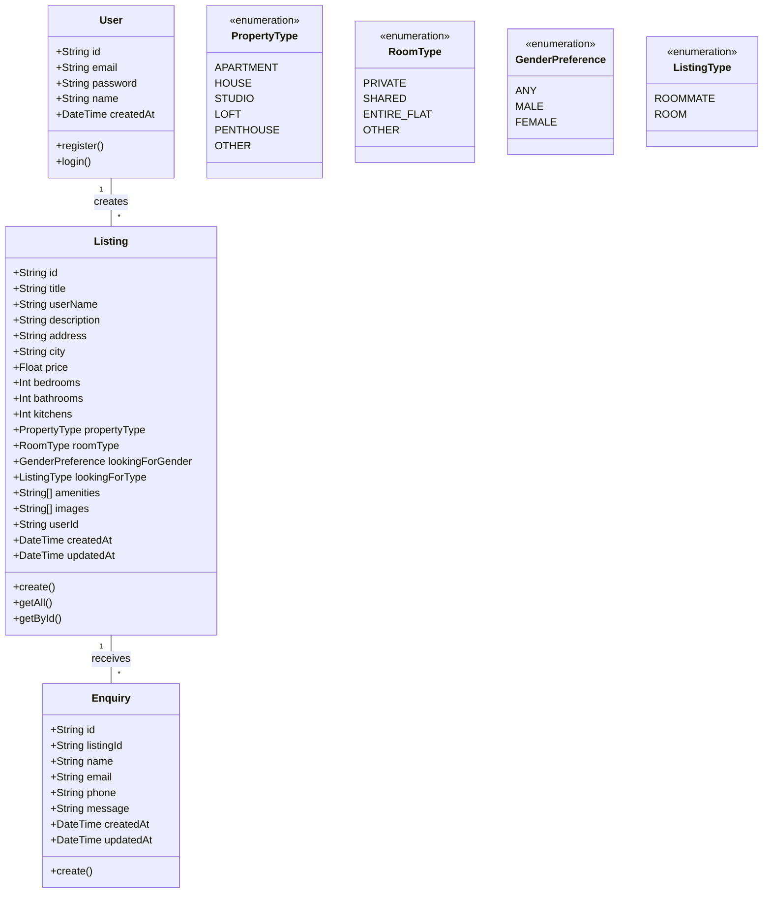

# FlatLink Class Structure

```mermaid
classDiagram
    %% Core Entities
    class User {
        +String id
        +String email
        +String password
        +String name
        +DateTime createdAt
        +register()
        +login()
    }

    class Listing {
        +String id
        +String title
        +String userName
        +String description
        +String address
        +String city
        +Float price
        +Int bedrooms
        +Int bathrooms
        +Int kitchens
        +PropertyType propertyType
        +RoomType roomType
        +GenderPreference lookingForGender
        +ListingType lookingForType
        +String[] amenities
        +String[] images
        +String userId
        +DateTime createdAt
        +DateTime updatedAt
        +create()
        +getAll()
        +getById()
    }

    class Enquiry {
        +String id
        +String listingId
        +String name
        +String email
        +String phone
        +String message
        +DateTime createdAt
        +DateTime updatedAt
        +create()
    }

    %% Enumerations
    class PropertyType {
        <<enumeration>>
        APARTMENT
        HOUSE
        STUDIO
        LOFT
        PENTHOUSE
        OTHER
    }

    class RoomType {
        <<enumeration>>
        PRIVATE
        SHARED
        ENTIRE_FLAT
        OTHER
    }

    class GenderPreference {
        <<enumeration>>
        ANY
        MALE
        FEMALE
    }

    class ListingType {
        <<enumeration>>
        ROOMMATE
        ROOM
    }

    %% Relationships
    User "1" -- "*" Listing : creates
    Listing "1" -- "*" Enquiry : receives
```
