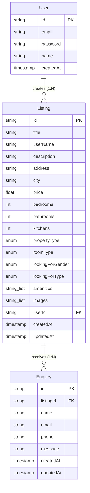

# FlatLink Database Schema

```mermaid
erDiagram
    %% Relationships
    User ||--o{ Listing : "creates (1:N)"
    Listing ||--o{ Enquiry : "receives (1:N)"

    %% User Entity
    User {
        string id PK
        string email
        string password
        string name
        timestamp createdAt
    }

    %% Listing Entity
    Listing {
        string id PK
        string title
        string userName
        string description
        string address
        string city
        float price
        int bedrooms
        int bathrooms
        int kitchens
        enum propertyType
        enum roomType
        enum lookingForGender
        enum lookingForType
        string_list amenities
        string_list images
        string userId FK
        timestamp createdAt
        timestamp updatedAt
    }

    %% Enquiry Entity
    Enquiry {
        string id PK
        string listingId FK
        string name
        string email
        string phone
        string message
        timestamp createdAt
        timestamp updatedAt
    }
```
