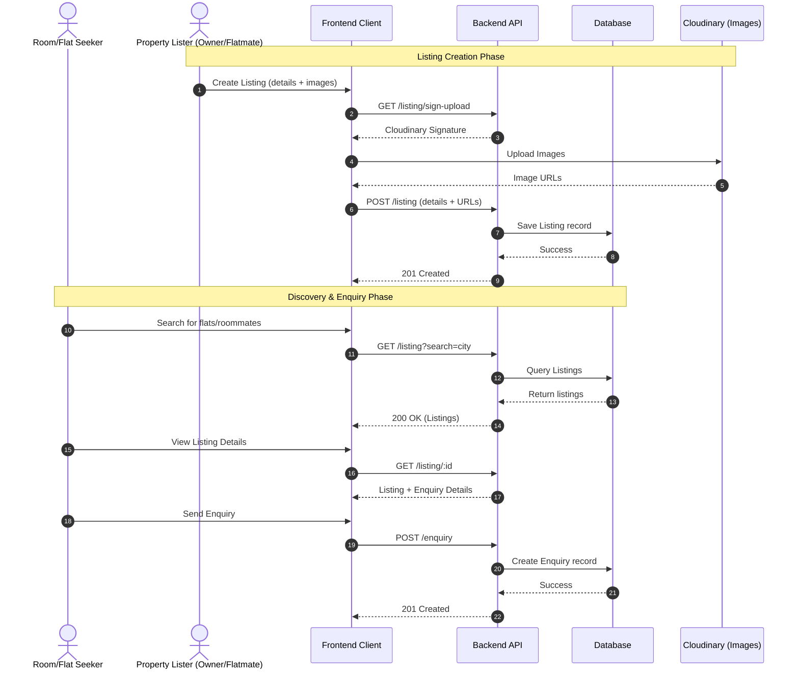

# FlatLink System Workflow

```mermaid
sequenceDiagram
    autonumber
    actor Seeker as Room/Flat Seeker
    actor Lister as Property Lister (Owner/Flatmate)
    participant Client as Frontend Client
    participant API as Backend API
    participant DB as Database
    participant Storage as Cloudinary (Images)

    Note over Lister, Storage: Listing Creation Phase
    Lister->>Client: Create Listing (details + images)
    Client->>API: GET /listing/sign-upload
    API-->>Client: Cloudinary Signature
    Client->>Storage: Upload Images
    Storage-->>Client: Image URLs
    Client->>API: POST /listing (details + URLs)
    API->>DB: Save Listing record
    DB-->>API: Success
    API-->>Client: 201 Created

    Note over Seeker, DB: Discovery & Enquiry Phase
    Seeker->>Client: Search for flats/roommates
    Client->>API: GET /listing?search=city
    API->>DB: Query Listings
    DB-->>API: Return listings
    API-->>Client: 200 OK (Listings)
    
    Seeker->>Client: View Listing Details
    Client->>API: GET /listing/:id
    API-->>Client: Listing + Enquiry Details

    Seeker->>Client: Send Enquiry
    Client->>API: POST /enquiry
    API->>DB: Create Enquiry record
    DB-->>API: Success
    API-->>Client: 201 Created
```
