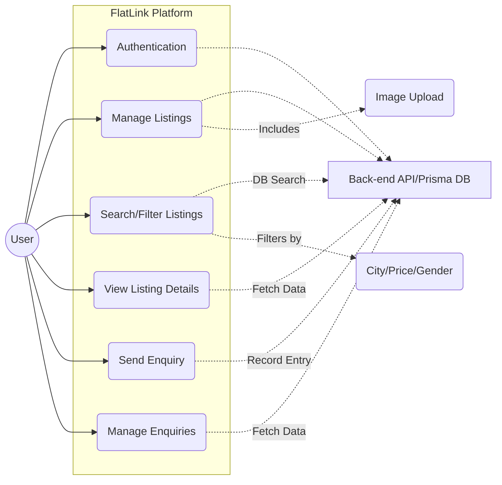

# FlatLink Use Case Diagram

```mermaid
graph LR
    %% Actors
    User((User))
    System[Back-end API/Prisma DB]

    %% System Boundary
    subgraph FlatLink_Platform [FlatLink Platform]
        direction TB
        UC1(Authentication)
        UC2(Manage Listings)
        UC3(Search/Filter Listings)
        UC4(View Listing Details)
        UC5(Send Enquiry)
        UC6(Manage Enquiries)
    end

    %% User Interactions
    User --> UC1
    User --> UC2
    User --> UC3
    User --> UC4
    User --> UC5
    User --> UC6

    %% System Interactions (Backend Logic)
    UC1 -.-> System
    UC2 -.-> System
    UC3 -.->|DB Search| System
    UC4 -.->|Fetch Data| System
    UC5 -.->|Record Entry| System
    UC6 -.->|Fetch Data| System

    %% Sub-features / Dependencies
    UC2 -.->|Includes| UCA(Image Upload)
    UC3 -.->|Filters by| UCB(City/Price/Gender)
```
